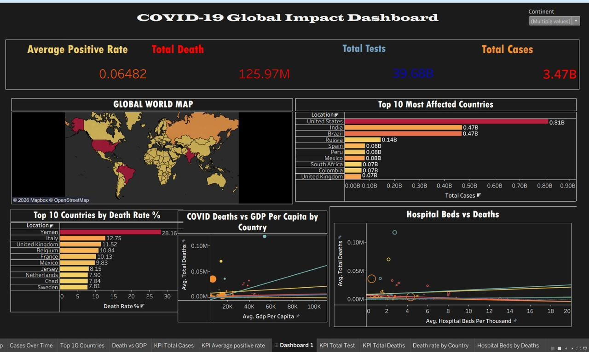

# COVID-19 Global Impact Dashboard

This project presents an interactive Tableau dashboard analyzing the global impact of COVID-19 using data visualization techniques.

## Dashboard Overview

The dashboard provides insights into global COVID-19 trends including cases, deaths, testing rates, and healthcare infrastructure across countries.

## Key Metrics

- Total COVID-19 Cases
- Total Deaths
- Total Tests Conducted
- Average Positive Rate

## Visualizations Included

1. **Global World Map**
   - Displays the geographical distribution of COVID-19 cases across countries.

2. **Top 10 Most Affected Countries**
   - Bar chart showing countries with the highest total confirmed cases.

3. **Top 10 Countries by Death Rate**
   - Highlights countries with the highest COVID-19 mortality rate.

4. **COVID Deaths vs GDP per Capita**
   - Scatter plot analyzing the relationship between economic development and deaths.

5. **Hospital Beds vs Deaths**
   - Shows correlation between healthcare infrastructure and mortality.

## Interactive Filters

Users can filter the dashboard by:

- Continent
- Country

## Tools Used

- Tableau
- Data Visualization
- Data Analysis

## Dataset

Global COVID-19 dataset containing cases, deaths, tests, GDP per capita, and hospital bed statistics.

## Dashboard Preview

## Author

Shadiya Moideen  
MSc Data Science – Vellore Institute of Technology
